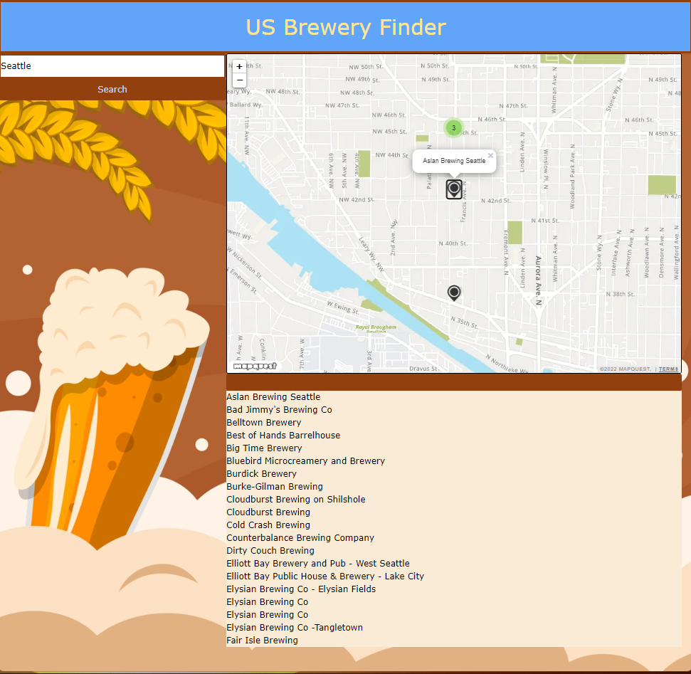

# US Brewery Finder
Javascript Brewery Finder in US Cities

## Table of contents
* [General info](#general-info)
* [Website](#webpage-URL)
* [Screenshots](#screenshots)
* [Credit](#credits)
* [Built with](#built-with)
* [Continued development](#continued-development)
* [Useful resources](#useful-resources)

## General info

When the user searches a US city, this app will respond with a list of breweries in that city as well as their address and phone number. It will also show locations on the map.

## User Story

> 
As a consumer looking for breweries 
> When I use this application 
> I will be presented with a list and map of all local breweries in the US city that I search

## Website

[US Brewery Finder](https://anomic84.github.io/US-Brewery-Finder/)

## Screenshots

### Built with

- Semantic HTML5 markup
- CSS custom properties
- Flexbox
- Tailwind CSS

### Continued development

Right now the Brewmaster API, when given a city, searches and returns ALL cities. In the future we hope to add a way to narrow down to specific city in the state. We would also love to have the mapquest map show the correct name on the markers when the city searched, as of right now it just shows one name for each marker.

### Useful resources

- [Open Brewery Database API](https://www.example.com](https://www.openbrewerydb.org/documentation) - Here are the Docs for the Open Brewery Database API
- [Mapquest API]([https://www.example.com](https://developer.mapquest.com/documentation/)) - Here are the Docs for the Mapquest API

## Credits

[Yuri Kwon](https://github.com/uriyuri00) 
[Chrissy Martin](https://github.com/chrissy-martin) 
[Spencer Carlson](https://github.com/anomic84) 

